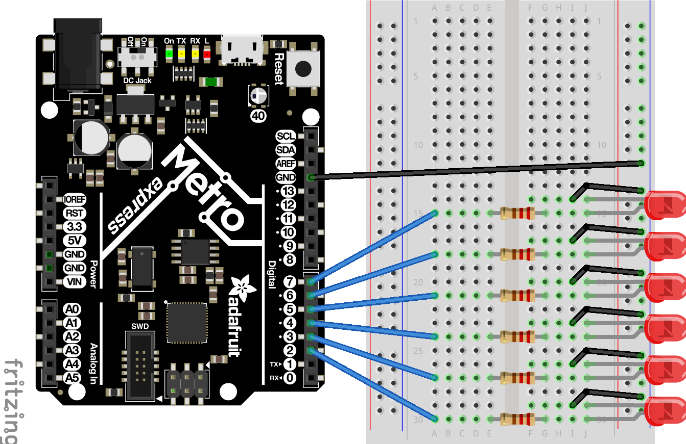

# Overview

The FancyLED assignment was somewhat of a continuation of the Classes, Objects, and Modules assignment. 
A `main.py` file was given, and the task was to create a library that suited the code. The main takeaway from this 
assignment was how to use lists. Lists are a handy way to group information and randomly or sequentially select the information, as was 
done in the sparkle method.

In the `main.py` file, the methods required were alternate(), blink(), chase(), and sparkle(). Additionally, another 
method was created called all_off(). The method all_off() turned off the LEDs of an object. It was created for 
convenience. 

Note that the `digitalio` library was used for the assignment. I am still trying to understand the `pulseio` library.
One drawback of CircuitPython is that one cannot read the code for many of the core libraries because they have 
been compiled to the `.mpy` format.

# Circuit Diagram

The original circuit diagram of the assignment was as follows:

However, the method by which the LEDs were wired was inefficient. Since I did not have enough wires to follow the
wiring diagram specifically, I used a wiring diagram that uses fewer wires but is as effective. 

Here is the revised wiring diagram: 

#### Note - The revised circuit diagram was made on Tinkercad, which does not have an Adafruit Metro MO Express import option. The circuit diagram might be changed another time if a better circuit diagram creator if found.

# Lessons Learned 

* Specific items in a list do not need to be individual class variables referred to with a `self.` statement. Rather, the list as a whole is the
  class variable that is accessed with a `self.` statement and one can individually address the items in the list with code that would be like `self.list[number]`.
  
* To address multiple items at a time in a list, the code would be like `self.list[number1, number2, etc.`.

* When writing code that says `self.list[number]`, the [] serve to index the list. It is strange, but the indexing
  begins at 0. For example, `self.led_list[0]` would refer to the first item in the list.
  
* The `range` method can be used to create a sequence of numbers. Range can be set between 0 and a variable to make it changeable. For example `range(0, number)`
  would make a sequence `0, 1, 2, 3, ... number-1`. It is helpful because, in a method, the variable can be set a standard but then also changed. 
  One can then use that sequence to loop over code.  The `range` method allows the code in the `main.py` to specify the number of loops that is wanted for a method. 
  
* Using `%2` in `if alternate_number % 2 == 0:` divides the `alternate_number` by 2 and then looks at the remainder. This
  is called the [Modulo](https://www.freecodecamp.org/news/the-python-modulo-operator-what-does-the-symbol-mean-in-python-solved/#:~:text=The%20%25%20symbol%20in%20Python%20is,%2C%20*%20%2C%20**%20%2C%20%2F%2F%20.) operator. 
  It is useful with the `range` function because if the range increases by whole numbers, it will either be an even number
  (remainder = 0), or an odd number (remainder does not = 0). Two opposite options were created using this idea, as 
  can be seen in the alternate method.

* My code comments explain most of how the code works. Here is my library code:
  [fancyLED.py](/FancyLED/fancyLED.py)
  
* Below is the `main.py` file that imported the `fancyLED.py` library:
  [main.py](/FancyLED/main.py)
  
* Additionally, my father recommended that I should not change the name of my `main.py` files because it creates 
  unnecessary confusion, and it is a bad habit to change file names arbitrarily as they may be referred to elsewhere, for example, a library. 
  To change file names safely, one can use PyCharm's "refactor" function that checks for anywhere that the code or file you are changing may be
  referred to and changes that too.
  
# On Using Black As A Code Formatter

The tool "black" is a code formatter that can work with any python (.py) file. Black re-formats code into a standard 
format, making organization simple and consistent.

To use back, open a terminal window in the same directory as the file and for example: black fancyLED.py

Here it the link to black:
[Link to black](https://pypi.org/project/black/)

